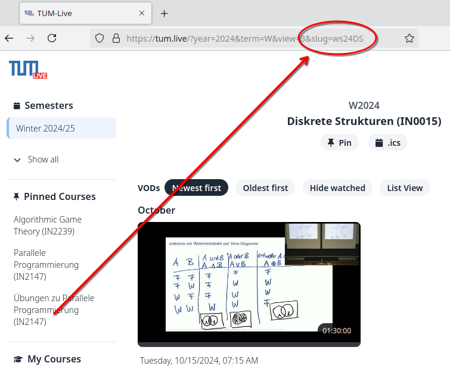

# TUM Live Recorder

No one should be required to attend an 8am lecture. Not even online. To enable usage of this basic human right, this project allows you to downloads livestreams from **tum.live** and **live.rbg.tum.de**.

This application *attends* the lecture for you while it is being streamed and you are still snuggly asleep. Like a good bot, it then downloads it on the fly using ffmpeg. What a world we're living in.

## Setup

#### The code:
```sh
git clone https://github.com/Lukasdoe/tum-live-recorder
cd tum-live-recorder
```

#### Python (tested with Python 3.9):
```sh
python3 -m venv ./.venv
source ./.venv/bin/activate
pip install -r requirements.txt
```

#### Chromedriver:

This project requires a chromedriver for webscraping. Make sure that the chromedriver binary is available in `/usr/lib/chromium-browser/chromedriver`. You can download chromedriver from https://googlechromelabs.github.io/chrome-for-testing/.

#### Credentials:

In order for the script to work, you need to create a **credentials.json** file in the root folder with the following format:

```json
{
  "username": "YOUR_TUM_USERNAME (ex. ge12abc)",
  "password": "YOUR_TUM_PASSWORD"
}
```
This allows the script to log in to tum-live and extract the currently playing streams.


## Usage

1. Navigate to your favorite early-morning lecture on https://tum.live/.
2. Have a look out your current URL. Extract your courses slug from `&slug=<your-slug>`, e.g. "ws24DS".
3. `python3 main.py <your-slug>`



## Automation

If you don't want to manually start the script every time a desired lecture is live, you can create a corresponding **cron-task** which starts the script at the correct time.

You can use this website to create the correct timings: [crontab.guru](https://crontab.guru/).

Make sure that the command in your crontab is actually executed in the correct Python virtual environment.s
